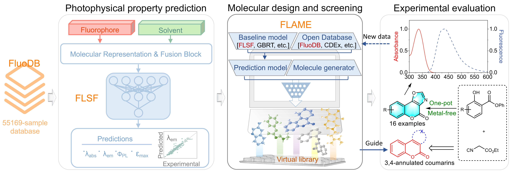

# FLAME: FLuorophore design Acceleration ModulE

This is a repository of the article "[A modular artificial intelligence framework to facilitate fluorophore design](https://www.nature.com/articles/s41467-025-58881-5)".


## Overview




## System Requirements

### Hardware and OS requirements

This code has been tested on Linux(Ubuntu 22.04) and Windows(10,11), which only requires a standard computer with enough RAM to support the in-memory operations.


### Python Dependencies
FLAME develop on python3.8 and mainly depends on these packages.
```
tqdm==4.66.2
torch==2.2.2
numpy==1.24.3
pandas==2.0.3
scikit-learn==1.3.2
packaging==24.0
typed-argument-parser==1.9.0
rdkit==2023.9.5
ase==3.22.1
tensorboardX==2.6.2.2
einops==0.7.0
h5py==3.10.0
padelpy==0.1.14
gdown==5.2.0
tables==3.8.0
pandas_flavor
```

### Set up the environment

We strongly recommand to install packages in [conda](https://docs.conda.io/projects/miniconda/en/latest/miniconda-install.html) environment.

After install conda, create an environmnet
```
conda create -n flame python==3.8
```
activate the environment and install the packages

```
conda activate flame
cd /dir/to/this/repo # !cd the dir you git clone or download this repository
pip install -r requirements.txt
```
and then you could use FLAME by python shell or jupyter.


## FLAME Usage

We provide [UVVISML, ABTMPNN, Schnet, FCNN, GBRT and FLSF ] 6 models as baseline, and each model has example code in FLAME/scripts.

### Database search

```
from FLAME import run_search
result_df = run_search(SMILES, similarity_limit, fingerprinter_type)
```

### Train and Predict

The basic format of trainning is:
```
from FLAME import flsf_train
flsf_train(model_path, train_data, valid_data, test_data, epoch)
```

And the prediction:
```
from FLAME import flsf_predict
flsf_predict(model_path, output_file, input_file=input_file)
```

or you can just run as a function:
```
from FLAME import flsf_predict
result = flsf_predict(model_path, smiles=SMILES)
```

## Reinvent FLAME_plugin

We provided a FLAME_plugin for Reinvent to molecule design and molecuar optimization.

Fisrt download the FLAME_plugin.zip and unzip the file to /path/to/python/lib/site-packages/reinvent_plugins

You can Create reinvent toml config file with scoring stage like:
```
[stage.scoring]
type = "geometric_mean"

[[stage.scoring.component]]
[stage.scoring.component.flame_abs]

[[stage.scoring.component.flame_abs.endpoint]]
name = "flame"  # user chosen name for output
weight = 10  # weight to fine-tune the relevance of this component
```
And flame_emi/flame_plqy/flame_e/stokes are also supported.


## Contact

We'd love to hear from you. Please let us know if you have any comments or suggestions, or if you have questions about the code or the procedure. Also, if you'd like to contribute to this project please let us know. Please feel free to email us (yuchenzhu@zju.edu.cn or zyman@zju.edu.cn).


## Note
This code leveraged and built on top of [Chemprop](https://github.com/chemprop/chemprop) .


## License 
This project is covered under the MIT License.